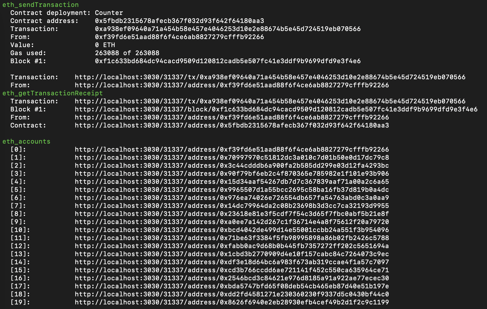
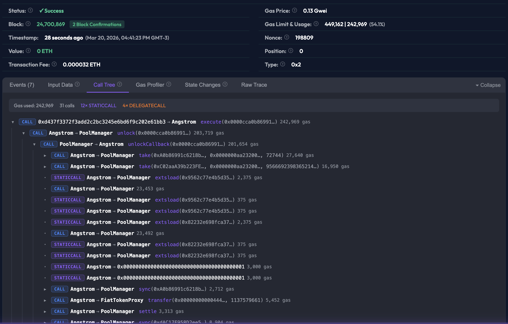

# @openscan/hardhat-plugin

A Hardhat 3 plugin that automatically launches a local [OpenScan Explorer](https://openscan.eth.link) and adds clickable transaction links to your terminal.





## Features

- **Local block explorer** — auto-launches on `hardhat node` and opens your browser
- **Clickable terminal links** — transaction hashes, addresses, and blocks are OSC 8 hyperlinks to the explorer
- **Contract deployment tracking** — matches bytecode to artifacts so the explorer shows contract names, ABIs, and source code
- **Works with Hardhat Ignition and raw deploy scripts**

## Quick Start

```bash
npm install --save-dev @openscan/hardhat-plugin
```

Add the plugin to your `hardhat.config.ts`:

```ts
import { defineConfig } from "hardhat/config";
import openScanPlugin from "@openscan/hardhat-plugin";


export default defineConfig({
  plugins: [openScanPlugin],
  solidity: "0.8.29",
});
```

Start a node:

```bash
npx hardhat node
```

The OpenScan Explorer will launch at <http://localhost:3030> and your browser will open automatically.

## Documentation

See the [plugin README](packages/plugin/README.md) for full configuration options, usage examples, and troubleshooting.

## Contributing

This repository is a pnpm monorepo. Make sure you have [`pnpm`](https://pnpm.io/) installed.

```sh
pnpm install
pnpm build
pnpm test
```

### Monorepo structure

- `packages/plugin` — the plugin source code
- `packages/example-project` — a Hardhat 3 project for manual testing

Running `pnpm watch` in the root is useful during development — it rebuilds the plugin as you edit, so changes are picked up when you test in `packages/example-project`.

### CI

GitHub Actions runs on every push to `main` and on pull requests: install, build, test, and lint using Node.js 24.

## License

MIT
